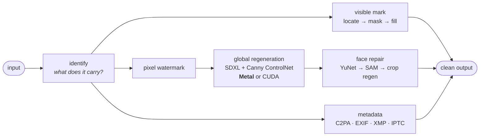

# pagedMark

[](https://github.com/doofzoff/pagedMark/actions/workflows/test.yml)
[](https://pypi.org/project/pagedmark/)


-e34c26)

**AI watermark removal built for Apple Silicon.** Strip provenance from images you
generated yourself — invisible pixel watermarks, visible vendor labels, and the metadata
that carries the rest — on the GPU already in your Mac.

Most tooling in this space assumes an NVIDIA card and treats anything else as a
fallback. pagedMark is the opposite: Metal is the primary target, and every decision in
the pipeline — which sampler runs, when the VAE tiles, how faces are repaired, where the
numerical floors sit — was measured on Apple hardware rather than inherited from CUDA.

```bash
uv tool install --force "pagedmark[diffusion]"
pagedmark invisible photo.png -o clean.png
```

```
  Input:    photo.png
  Pipeline: sdxl-zimage on mps
  Strength: 0.15
  Running SDXL Canny pass: strength=0.1500, steps=16 of 107...
  Repairing face 1/4 with SDXL: strength=0.0500, steps=8...
  Saved: clean.png  (2253 KB, 152.1s)
```

---

## Pipeline



Each branch runs only where its signal was found, and each reports what it did. The two
GPU stages are the only ones that need Metal; everything else runs on any machine.

## Capabilities

| Signal | Approach | GPU |
| --- | --- | --- |
| **Invisible pixel watermarks** — SynthID-class marks from gpt-image, Gemini, Nano Banana | Structure-guided diffusion regeneration disrupts the embedded pattern | Metal or CUDA |
| **Visible AI labels** — Gemini sparkle, Doubao, Jimeng, Qwen, Kling, Yuanbao, Baidu, LibLibAI, Samsung Galaxy AI | Located in its expected region, masked, and filled | None |
| **Provenance metadata** — C2PA Content Credentials, EXIF, XMP, IPTC, generator parameters, TC260 AIGC tags | Format-aware stripping that never recompresses the image | None |
| **Video** — Sora, Veo, Seedance, Dola, Hailuo, Kling marks, and video SynthID | Per-frame removal with audio copied untouched and timestamps preserved | None for marks and metadata; Metal or CUDA for SynthID |
| **Region erase** — anything you point at | User-directed inpainting with OpenCV, MI-GAN, or LaMa | None |

Always start by asking what a file actually carries:

```bash
pagedmark identify photo.png
```

`identify` reports **unknown** rather than *clean* when it finds nothing. Metadata is
erased by re-encoding, screenshots and uploads, and no public local decoder exists for
SynthID-class watermarks — so absence of evidence is reported as exactly that.

## Why Metal-first matters

Apple Silicon is not a smaller CUDA card. Four differences change the output, and each
number below was measured on an M5 whose unified memory budget
(`torch.mps.recommended_max_memory()`) is 11.84 GiB.

### The distilled sampler had to go

Four-step distillation LoRAs are trained for four timesteps spanning the entire noise
range. A low-strength edit runs the *tail* of a long schedule instead, which is off
that distribution — and wherever nothing conditions the model (flat dark fabric offers
the ControlNet no edges) it fills the gap by inventing texture.

| Global stage · 1448×1080 · strength 0.15 | Invented texture | PSNR | Wall |
| --- | --- | --- | --- |
| Distilled, 4 steps | 1.73× source | 28.54 dB | 41 s |
| Distilled, 8 steps | 1.80× | 28.19 dB | 29 s |
| Distilled, 16 steps | 1.84× | 27.85 dB | 62 s |
| **Undistilled base, 16 steps** | **1.19×** | **29.25 dB** | 71 s |
| Undistilled base, 24 steps | 1.20× | 29.17 dB | 132 s |

More steps of the distilled model make it *worse*, which is what identifies the
distillation rather than the step count as the cause. 24 undistilled steps buy nothing
over 16, so 16 is a measured knee.

### Faces are repaired by the stack already in memory

The high-fidelity face model in this lineage streams float8 weights, and Metal
implements no float8 tensor type at all. So the stage keeps its shape — face detection,
SAM masks, each crop regenerated from the **original** at a lower strength, feathered
back in — and substitutes the SDXL stack already resident for the global pass. Nothing
extra to load.

| Four faces · measured against the source | Whole frame | Faces (mean) |
| --- | --- | --- |
| Global stage only | 29.00 dB | 27.39 dB |
| **With the face stage** | **29.14 dB** | **30.50 dB** |

### Memory is measured, not hoped for

Metal answers an oversized allocation by paging rather than failing, so a run that
"works" can silently take an hour. pagedMark reads the budget and decides:

- **VAE tiling only where it pays.** Untiled, a 1.57 MP frame needs 18.74 GiB against an
  11.84 GiB budget and survives on swap alone, at 2.6× the wall time. On a 64 GiB Mac
  the same frame decodes whole, because tile boundaries leave a faint texture worth
  avoiding when there is room for none.
- **Oversized frames tile at native geometry**, so nothing is quietly downscaled to fit.
- **Attention slicing always on**, the device cache released between passes, and noise
  drawn on a CPU generator so one seed means one result across machines.

### Video runs here too

Video is not a CUDA-only corner of this project. Visible mark removal and metadata
stripping need no GPU at all, and SynthID regeneration — a VAE round-trip with one
latent-noise field shared across time — resolves to Metal through the same probed device
ladder as the image path, releasing the device cache per frame batch so a clip's peak
stays at one batch instead of growing with its length.

```bash
pagedmark video identify clip.mp4      # what the container and pixels carry
pagedmark video all clip.mp4 -o clean.mp4   # visible marks + metadata, CPU
pagedmark video invisible clip.mp4 -o clean.mp4   # SynthID regeneration, Metal
```

Audio is copied without re-encoding, variable frame intervals survive through a
timestamped bridge rather than being flattened, and the completed encode is published
atomically. The regeneration profile's own numbers were measured on CUDA; the Metal path
runs the same graph, and the wall time is the difference to expect.

### 8 GB Macs are a supported target, not a rounding error

The stack is 7.7 GiB of weights once the text encoders are gone, and an 8 GB Mac reports
a working set of roughly 5.3 GiB — so it does not fit, with or without that saving.
Rather than refuse, pagedMark reads the budget and streams the weights from the CPU one
module at a time. Same output, and a peak that fits anything:

| Same frame, same seed | Peak device memory | Wall |
| --- | --- | --- |
| Weights resident (16 GB Mac) | 7.70 GiB | 7.1 s |
| Weights streamed (8 GB Mac) | **0.28 GiB** | 24.1 s |

The plan is chosen from the measured budget and then **stated**: a run three times
slower than the fast path says so before you wait through it, instead of looking broken.
Below about 2 GiB nothing is left to trade, and the refusal names the commands that still
work there rather than failing inside a model loader.

One saving was measured, implemented, and then withdrawn. Encoding the two fixed prompts
once and releasing the text encoders frees 1.52 GiB of a loaded 8.79 GiB — and with them
released, two of the four face crops in a test photo came back as **all-zero black
rectangles**, deterministically, at the same seed that produced correct faces with them
resident. The embeddings are not at fault (CPU and Metal encodings of that prompt agree to
0.0009 on tensors with a standard deviation of 3.06, and the same crop generated in
isolation is correct either way); the allocation pattern the crops meet after the global
pass is. 1.5 GiB is not worth a black rectangle over someone's face, and the offloaded
path does not need it. A guard now drops any empty crop and keeps the global stage's face
instead, whatever produced it.

### A preview, sized to be worth running

`--preview` answers "what will this do to my picture" before the real run. It caps the
frame at 512 px, shrinks the face crops with it, and repairs the largest face only —
because capping the frame alone changes nothing: the face stage scales every crop toward
a 768 px guide regardless of the frame, so a naive preview cost 66 s against the real
run's 113 s. With all three caps it is **46.6 s against 112.6 s** on the measured photo.

It writes `<source>_preview.png`, never the `_clean` name, and prints what it is. Its
fidelity numbers are not the run's numbers: a preview shows character, not final quality,
because the downscale and upscale are part of what you are looking at.

### Metal has numerical floors

Below a face strength of 0.05 the fp16 path stops producing an image: three of four
faces returned as garbage at the 0.025 a naive policy computes. That floor lives in code
and is pinned by a test, not carried as folklore.

## Requirements

- Apple Silicon (M-series) running macOS, or an NVIDIA GPU
- Python 3.11 – 3.14
- ~10 GB disk for the diffusion model stack on first run
- 16 GB unified memory is enough for the Metal path; more removes the tiling compromises

There is no CPU path for invisible removal, and pagedMark refuses a device that cannot
run it instead of falling back to something that will not finish. Visible-mark removal,
metadata stripping and `identify` run anywhere.

## Install

| You want | Install |
| --- | --- |
| Metadata inspection and stripping | `pagedmark` |
| Visible marks and region erasing | `pagedmark[visible]` |
| **Invisible removal on Apple Silicon** | `pagedmark[diffusion]` |
| Invisible removal on NVIDIA | `pagedmark[qwen-zimage]` |
| Video | `pagedmark[video]` |
| Everything available on your Python | `pagedmark[all]` |

**Python 3.11 or newer is required, and macOS ships 3.9.** So `pip3 install pagedmark`
against the system interpreter reports that no matching distribution exists, even though
the package is there: old pip filters every file out by `Requires-Python` and says so
badly. `uv` avoids the question by managing its own interpreter. With pip, name a modern
one:

```bash
uv python install 3.12 && uv pip install --python 3.12 pagedmark
```

On macOS the default PyTorch wheel already ships Metal support, so
`pagedmark[diffusion]` is the complete Apple Silicon install — it deliberately omits the
float8 model stack that cannot load there.

## Usage

```bash
# What is in this file?
pagedmark identify photo.png

# Visible mark and metadata — no GPU required
pagedmark visible photo.png -o clean.png
pagedmark metadata photo.png --remove -o clean.png

# Erase a region you choose
pagedmark erase photo.png --region 1640,1930,400,100 -o clean.png

# A faster, lower-resolution look before committing to the real run
pagedmark invisible photo.png --preview

# The full pipeline: visible → invisible → metadata
pagedmark all photo.png -o clean.png

# A whole directory
pagedmark batch ./photos --mode all

# What did the run cost the picture?
pagedmark measure photo.png clean.png

# Right-click an image in Finder instead of typing any of this
pagedmark quick-action

# Video
pagedmark video identify clip.mp4
pagedmark video all clip.mp4 -o clean.mp4
pagedmark video invisible clip.mp4 -o clean.mp4
pagedmark video batch ./clips --mode all
```

The device is detected and the pipeline follows from it. Both are printed before the run
starts, so a substituted stage is something you read rather than something you discover
in the output.

`measure` answers the question a README cannot answer for your file. It reports PSNR over
the frame, PSNR per detected face, invented texture, and the coordinates of the block
that moved furthest:

```
Whole frame:      29.36 dB
Faces:            none detected
Invented texture: 0.34x the source
Biggest change:   15.59 dB in a 48px block at (96, 144)
```

That last line exists because the first four are averages, and an average cannot see a
ruined caption: a row of small text is a fraction of a percent of the pixels. The
coordinate does not classify what changed, only where the change is largest, which is
where to look first.

### Finder, for when a terminal is the wrong tool

```bash
pagedmark quick-action              # install
pagedmark quick-action --uninstall  # remove
```

Right-click an image (or a selection of them) in Finder, choose **Quick Actions -> Clean
with pagedMark**, and the cleaned files land beside the originals as `<name>_clean.<ext>`.
Each run announces its start and its result as a notification, because a pass takes tens
of seconds with no window and silence is indistinguishable from a broken install.

The absolute path to the executable is resolved when you install the action and written
into it. Finder launches services with a minimal `PATH` -- roughly `/usr/bin:/bin` -- so
an action that called `pagedmark` by name would work when tested from a terminal and do
nothing at all from the menu.

### Python

```python
import pagedmark as pm

report = pm.identify("photo.png")
result, removed = pm.remove_visible("watermarked.png", "clean.png")
```

## What this does not claim

- **Regeneration is not payload deletion.** The image changes; faces, text and fine
  detail can move. Every figure above is the measured size of that change, so the
  tradeoff is yours to accept rather than a promise to trust.
- **Metal is not bit-identical to CUDA.** The same seed and strength produce a
  *different image* on the two backends. Operating points transfer between them;
  verdicts recorded against a provider's verifier do not.
- **The Metal face stage is a different model** from the CUDA one. It measured better
  than no face stage, and face crops carry less disruption than the frame does — the
  same bargain the CUDA stage strikes.
- **Verify what matters.** Where a provider publishes a verifier, run the output through
  it before relying on the result.

## Scope

For content you generated or own. pagedMark does not target stock-agency previews,
marketplace or classifieds watermarks, or any mark protecting someone else's paid asset:
the visible-mark registry accepts AI-generation labels only, and the region eraser is
user-directed by design. See [scope, safety and legal notes](docs/legal-and-safety.md).

## Documentation

- [CLI guide](docs/cli.md) · [Python API](docs/python-api.md) ·
  [Installation](docs/installation.md)

## License

[Apache 2.0](LICENSE)
