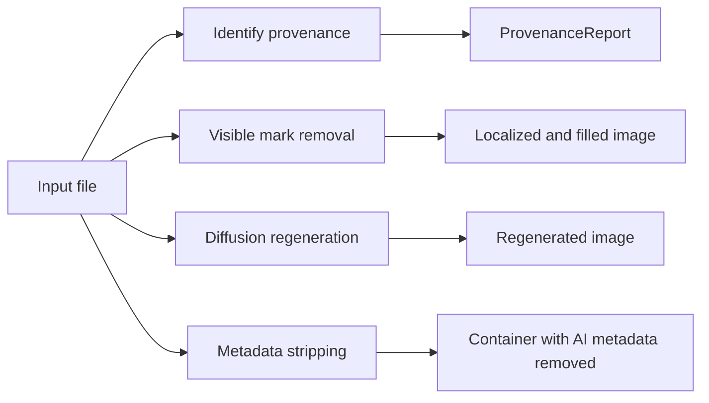

# Module internals

This page documents the current implementation contract. It intentionally
avoids experiment logs, corpus counts, and calibration history. Those records
live in [the verification plan](verification-plan.md) and the research archive
listed in [the documentation index](index.md).

Read the relevant section before changing a subsystem. When this page and the
code disagree, the code and its tests are authoritative and this page must be
updated in the same change.

## Architecture

The package has four main paths:

The `all` command runs visible removal, optional invisible regeneration, and
metadata stripping in that order.

## Command line interface

[`cli.py`](../src/pagedmark/cli.py) owns command parsing and
user-facing exit behavior.

Important contracts:

- Single-image arguments reject directories.
- `visible` writes no output when no registered mark is selected and exits with
  `EXIT_NO_VISIBLE_MARK`.
- `invisible` writes no output when no supported local signal is found, unless
  `--force` is supplied.
- The two no-signal conditions currently share exit code `2`.
- Hard processing and write failures exit with code `1`.
- `all` can still write the completed visible and metadata stages when the
  diffusion dependencies are unavailable, but exits with code `1` so the
  partial result is not reported as complete.
- `batch` counts per-file failures and exits nonzero if any file failed or an
  applicable invisible stage was skipped because its dependencies were absent.

The decorators for diffusion options are shared by `invisible`, `all`, and
`batch`. The runtime help generated by Click is the source of truth for option
names and defaults.

`--adaptive-polish` is tri-state: it declares `default=None`, so "the user did not
choose" is a value the CLI passes through rather than a default it has to invent.
`resolve_adaptive_polish` in `watermark_profiles.py` turns that `None` into the
profile's answer (off for `qwen-zimage`, whose output already matches the input's
detail level; on for `sdxl-zimage`). The same call runs inside
`InvisibleEngine.remove_watermark`, so a library caller and a CLI caller on one
profile get the same output.

It used to read Click's parameter source in the CLI instead. That put per-profile
data in the argument-parsing layer, left the engine declaring the opposite default,
and silently lost the polish for anything supplying the flag non-interactively (an
envvar default or a wrapper calling `main()` with a defaulted list is classified
`DEFAULT`). The seed follows the same rule: the CLI does not pre-resolve it either.

Regression coverage:

- [`test_cli.py`](../tests/test_cli.py)
- [`test_cli_robustness.py`](../tests/test_cli_robustness.py)
- [`test_optional_deps.py`](../tests/test_optional_deps.py)

## High-level Python API

[`api.py`](../src/pagedmark/api.py) provides the visible-mark entry
points:

- `remove_visible`
- `visible_provenance`

and the image pipeline that the `all` and `batch` commands are thin wrappers
over:

- `remove_all`, returning a `RemoveAllResult` after the visible, invisible, and
  metadata stages
- `remove_batch`, returning a `BatchSummary` for one directory and one mode
- `InvisibleOptions`, the invisible stage's knobs as one immutable value. Engine
  knobs only, under the engine's own names and defaults, so a bare
  `InvisibleOptions()` behaves exactly like calling the engine with no arguments.
  The engine takes them across two callables, `__init__` for what shapes the
  loaded stack and `remove_watermark` for the per-image ones, so `_run_invisible`
  forwards each field to the right one rather than splatting the whole bag. Two
  defaults silently stopped
  mirroring: `max_resolution=None` reached `_target_size`'s `max_resolution > 0`
  and raised `TypeError` on every library call, and `cpu_offload=True` made a
  library run slower than the identical CLI run.
  `TestInvisibleOptionsMirrorTheEngine` compares the two signatures field by
  field, and deliberately keeps no exception table: a field needing one is a
  field that belongs elsewhere. `force` was such a field, and it decides whether
  the engine runs rather than how, so it is a parameter of `remove_all` and
  `remove_batch` next to `backend` and `sensitivity`
- `MetadataStripIncomplete`, raised before any write when AI metadata survives

`remove_all` reports progress as `(stage, detail)` pairs of stable tokens, not
prose the caller has to parse back.

The package root exposes all of them lazily through
[`__getattr__`](../src/pagedmark/__init__.py), keeping a plain package
import free of the heavier image and model imports.

For path inputs, `remove_visible` reads provenance metadata, preserves alpha,
and optionally writes and strips metadata. Array inputs are treated as BGR
arrays and have no file provenance or separate alpha plane.

When no visible mark is removed, a same-format path copy preserves the original
bytes. `write_noop=False` leaves the requested output path untouched instead.

Regression coverage:

- [`test_api.py`](../tests/test_api.py)
- [`test_image_io.py`](../tests/test_image_io.py)

[`video.py`](../src/pagedmark/video.py) provides the high-level
video entry point:

- `identify_video`
- `inspect_video_metadata`
- `remove_video_all`
- `remove_video_batch`
- `remove_video_invisible`
- `remove_video_metadata`
- `remove_video_visible`

The video API validates both the supported extension and container signature,
then delegates all metadata detection and stripping to `metadata.py`. It
requires a separate same-container output, defaulting to `<source>_clean`, so
the product path does not overwrite an original. The package root exposes all
functions lazily.

`identify_video` runs the same stable-mark selection helper as
`remove_video_visible`, so a provenance report cannot authorize a mark that the
removal path would reject. It reports an empty local result as unknown rather
than clean. Identification skips the separate per-frame timestamp probe because
it never encodes frames. `remove_video_all` is the predictable-output
composition: visible removal plus verified metadata stripping by default, with
a same-container passthrough when neither signal exists. The lossy invisible
removal stage is an explicit opt-in through the oracle-certified profile.
`remove_video_batch` applies those contracts sequentially across a top-level
directory, returns every per-file failure, and byte-copies visible no-ops so a
successful output set has no silent holes. An invisible batch loads one VAE
runtime and reuses it across every compatible file; a failed model load is
reported per file without retrying the same multi-GB initialization.

Native MP4/MOV TC260 labels follow TC260-PG-20257A:
`moov.udta.meta.keys` maps an `AIGC` key to a raw JSON value in `ilst`.
[`_internal/isobmff.py`](../src/pagedmark/_internal/isobmff.py) walks those
nested boxes by seeking, so detection reaches a tail `moov` without reading the
preceding `mdat`. The MP4/MOV/M4V/M4A removal path first validates the top-level
box walk, then copies the source to a sibling temporary file in bounded chunks.
Supported C2PA/JUMBF/AI-label boxes become same-size `free` boxes with blank
payloads; TC260 removal changes the four-byte key to `free` and blanks only the
validated JSON value with same-length spaces. This preserves every box size,
`stco`/`co64` offset, encoded stream byte, and source-sized memory bound.
Publication is atomic, and a malformed top-level walk is copied unchanged. A
generic `AIGC` key whose value has no TC260 field is ignored.

[`_internal/ebml.py`](../src/pagedmark/_internal/ebml.py) provides the
corresponding bounded Matroska/WebM reader. It seeks over clusters and accepts
only a `Segment.Tags.Tag.SimpleTag` pairing `TagName=AIGC` with a JSON
`TagString` carrying a TC260 field. The existing ffmpeg stream-copy path removes
those container tags without transcoding the encoded streams.

[`_internal/riff.py`](../src/pagedmark/_internal/riff.py) and
[`_internal/flv.py`](../src/pagedmark/_internal/flv.py) implement the remaining
normative TC260 video placements. The RIFF walker reads only AVI
`LIST/INFO/AIGC` children. The FLV walker skips media tags and parses the AMF0
`script.onMetaData.AIGC` string. Both require a recognized TC260 JSON field and
use the verified ffmpeg stream-copy path for removal.

[`video_encoding.py`](../src/pagedmark/video_encoding.py) owns the
ffmpeg command and pipe lifecycle shared by visible removal and invisible
regeneration. It centralizes container codecs, optional audio stream copying,
metadata/chapter policy, encode-failure reporting, and atomic same-directory
publication. Each mapped stream is allowed to reach its own end, so a copied
audio tail is not shortened to the frame-input duration.
Both the raw-BGR and timestamped-NUT stdin modes redirect ffmpeg stderr to a
temporary file while frames are written. Waiting to read diagnostics until
after stdin closed allowed stderr backpressure to stop ffmpeg's frame reads,
which in turn blocked the producer before it could close stdin. The file consumes
no pipe capacity or RAM while ffmpeg runs; completion reports a bounded head and
tail when diagnostics are unusually large. Aborts release it even when ffmpeg
has already exited. A real subprocess regression writes diagnostics beyond pipe
capacity while streaming frames, checks bounded failure reporting, and the Linux
full-clip CI job guards the complete path.
Frame encoding and source-audio copying run as two ffmpeg processes in sequence.
The streaming encoder has only the frame pipe as input, so input probing or
demux queues cannot deadlock the producer against a second input. After that
pipe reaches EOF, a finite stream-copy mux combines the encoded video with the
source audio and applies the requested metadata/chapter policy. Both stages use
sibling temporary files, and only the completed mux is published atomically.
The mux also redirects diagnostics to disk and reports only a bounded head and
tail. Command regressions assert the single-input encoder and final map targets;
failure regressions cover bounded mux diagnostics and atomic cleanup.
`probe_video_encode_profile` reads the first source video stream with ffprobe
and preserves the supported properties that survive the 8-bit BGR boundary:
`yuv420p`/`yuv422p`/`yuv444p` chroma sampling, recognized color tags, encoder
time base, MP4/MOV track timescale, source pixel format, and component depth.
Both raw-CFR and timestamped-NUT inputs use ffmpeg's passthrough FPS mode. This
keeps one encoded frame per supplied frame when an older ffmpeg receives a
fine-grained source encoder time base such as `1/90000`; implicit synchronization
can otherwise synthesize thousands of duplicate frames between CFR timestamps.
HDR transfer functions and component depths above 8 bits are rejected before
encoding so the OpenCV boundary cannot silently reduce them to SDR 8-bit.
`probe_video_timestamps` reads authoritative per-frame display PTS through
ffprobe. OpenCV timestamps are only a count-matched fallback when ffprobe is
unavailable or fails; this avoids decoder anomalies such as one spurious
negative first-frame timestamp turning a CFR clip into false VFR. A uniform sequence keeps the
cheap raw-BGR pipe unless the source starts at a non-zero PTS. A variable or
offset sequence is packetized by the lazy PyAV bridge as rawvideo in an
in-memory NUT stream with explicit PTS. System ffmpeg reads that stream with
`-fps_mode passthrough`; `-copyts` additionally retains a non-zero video start
and the corresponding copied-audio offset. No temporary frame sequence or
second video encoder is introduced.

[`video_temporal.py`](../src/pagedmark/video_temporal.py) owns the
shared optical-flow maps and temporal residual metric. Visible removal uses
`stabilize_filled_frame` after the selected image backend: it works on a
bounded crop around adjacent masks, backward-warps the prior cleaned frame,
requires high warped-mask coverage, and gates blending on an unmasked
source-context ring. Only covered current-mask pixels change. Scene cuts,
disjoint marks, and poor motion matches therefore retain the independent
current-frame fill. The same module supplies the motion-compensated metric used
by the invisible-video sweep.

[`video_invisible.py`](../src/pagedmark/video_invisible.py)
implements the oracle-certified video SynthID removal engine. It samples frames
uniformly, resizes to a VAE-aligned geometry, encodes each frame to latent
space, applies one seeded spatial-noise field across the entire sequence, and
decodes fresh pixels. Reusing a single noise field avoids independent
frame-to-frame noise. The shipped path retains only one configured frame batch,
updates PSNR and temporal residuals incrementally, and streams BGR frames
directly to the video-only ffmpeg encoder. A separate stream-copy mux then adds
optional source audio and drops all source metadata. The result is written
through same-directory temporary files and atomically replaced only after both
stages succeed.

The engine returns PSNR and a motion-compensated temporal-residual ratio as
quality measurements. Neither is a watermark detector. The high-level result
reports completed removal without a separate verification-status flag. The companion
`scripts/video_synthid_sweep.py` imports the same engine helpers to build a
matched control and candidate grid, preventing research and shipped
regeneration paths from drifting.

The engine's `psnr_db` is measured against the already-resized frame and before
the encoder, so it scores the VAE round trip plus latent noise and cannot see
the downscale, the decimation, or the codec. No in-loop metric can: the
candidate frame is captured before it reaches the encoder pipe.
`scripts/video_fidelity_probe.py` covers the rest by decoding the delivered file
after muxing, upscaling it back to the source geometry, and scoring it against
the untouched source frames. It also reports the delivered file's bitrate, so a
fixed-crf bitrate rise cannot read as unchanged quality; because the mux copies
source audio verbatim, that figure is a container bitrate, not a video one. The
probe streams and accumulates the same way the engine does, so its peak memory
does not grow with clip length. It drives the source through the engine's own
`_iter_sampled_frames` at the source geometry rather than repeating the
selection rule: a frame-count check cannot catch a rule that reorders frames
without changing how many, so the rule itself has to be shared.

`load_video_vae_runtime` asserts the default model's latent scaling factor
against `VIDEO_SYNTHID_VAE_SCALING_FACTOR` and warns that no certified profile
exists for any other model. The published `sd-vae-ft-mse` config carries no
`scaling_factor` key, so the value is a `diffusers` class default under an
upper-unbounded pin, and the certified profile is a perturbation-to-signal ratio
rather than a bare `noise_std`. A library bump that moved that default would
otherwise rescale every perturbation with a green suite. The validated factor is
carried on `VideoVaeRuntime` and passed into encode and decode, so the gated
value and the applied value are one measurement rather than three independent
reads. `scripts/video_synthid_sweep.py` loads through the same function: the
harness that produces the certified rows is the last place that should be exempt
from the gate. The full-clip oracle floor is
`noise_std=0.15`: on the public eight-second Veo carrier, `0.10` remained
detected while `0.15` did not.

[`video_visible.py`](../src/pagedmark/video_visible.py) implements
the first pixel stages for Sora, Veo, Seedance, Dola, Hailuo, and Kling. The
Sora detector searches a normalized frame with a fully synthetic
mascot-and-text silhouette at several scales. The Veo detector uses separate
synthetic silhouettes for the current four-point diamond and legacy `Veo`
text. Seedance uses a synthetic rounded boxed-`AI` silhouette, while Dola uses
an OpenCV-font `Dola AI` silhouette. Hailuo uses a synthetic waveform,
MINIMAX/Hailuo text, separator, and ring. Kling combines synthetic font
variants with a ring approximation of its swirl; the logo path rescues
wordmarks whose version or font differs, while the edge and white-label gates
reject recurring scene texture. All fixed-mark searches are bounded to the
expected lower-frame area and calibrated independently. A strong relocated Veo
diamond may bypass the known layout anchors, but weak free-corner matches never
enter the temporal arbiter.

The default `auto` route decodes each frame once, shares its grayscale and
normalized representations across all detectors, and caches resized synthetic
template features for the fixed stream geometry. Provider confidence scales
are not comparable: selection applies each provider's temporal arbiter and
takes the first stable result in specificity order (`sora`, `veo`, `seedance`,
`dola`, `hailuo`, `kling`). An explicit mark uses the same scan path with one
candidate. Removal also collects authoritative per-frame timestamps for the
encoder, while identification omits that unused ffprobe pass.

Every per-frame result is untrusted. Each provider's floors, minimum-run policy,
fill padding and mask style are one row in `VISIBLE_MARK_POLICIES`, and every mark
enters the same `stabilize_localizations` entry point; the recurrence
implementation underneath knows nothing about providers. That policy row also
carries `accepts_provenance`, which forces `provenance=False` for Hailuo and Kling
— they have no metadata that could confirm them, and the guarantee used to be
structural (their wrappers took no `provenance` parameter at all). Provenance can relax a low-contrast run only
after recurring visual evidence exists. Sora transition frames follow the
nearest confirmed moving position only with Sora provenance. Seedance, Dola,
Hailuo, and Kling additionally require candidates to remain anchored to the
start of a run. This rejects slowly drifting scene details that still have
high frame-to-frame overlap. Hailuo and Kling do not infer provenance from
technical encoder tags; their confirmed public samples carried no provider
metadata.

Removal runs in a second decode pass. Sora, legacy Veo text, Dola text,
Seedance, Hailuo, and Kling use box masks. Seedance deliberately fills the
complete localized box: a synthetic outline mask passed repeat detection but
left part of the real translucent border visible during visual end-to-end
review. Hailuo expands beyond the matched core to cover both provider icons.
Kling expands around the wordmark or swirl to include the version and optional
`PRO` suffix. The square Veo diamond uses a synthetic shape mask so transparent
corners do not erase unrelated pixels. Every mask goes through the shared
`watermark_registry.fill` backends. ffmpeg encodes the changed video stream and
copies optional audio. The default OpenCV fill is the speed floor; structured
backgrounds need MI-GAN or LaMa for better reconstruction. Invisible video
stages must continue to reuse the image and metadata implementations rather
than copying their logic.

Regression coverage:

- [`test_video.py`](../tests/test_video.py), including a real ffmpeg full-clip
  Sora/OpenCV path that generates a synthetic marked MP4 with AAC audio and
  C2PA provenance, runs both `remove_video_visible` and the composed
  `remove_video_all` API without mocks, and verifies complete removal, frame
  count, frame rate, duration, untouched-region PSNR, paired temporal deltas
  inside the filled region, byte-identical copied audio packets, source stream
  properties, metadata stripping, and a large-`mdat` metadata case that rejects
  any full-source `read_bytes()` call. CI installs ffmpeg explicitly for this
  test so the integration gate cannot silently skip.
- [`test_video_fidelity_probe.py`](../tests/test_video_fidelity_probe.py), which
  builds its clips from solid-color frames whose index is recoverable from the
  pixels, so a decimation that keeps the frame count but shifts the phase scores
  far worse instead of passing unnoticed. It also asserts that the probe binds the
  engine's sampler rather than a copy of it, and it holds the suite's only
  constraint on that sampler's phase. Nothing here needs a model, but it does need
  ffmpeg, so CI runs this file in the same job that installs it.

## Metadata and provenance

### C2PA

[`_internal/c2pa.py`](../src/pagedmark/_internal/c2pa.py) reads C2PA with the
official `c2pa-python` reader first. Its byte-level PNG parser remains a fallback
for partial and synthetic fixtures that the official reader rejects.

Structured extraction is limited to the active manifest and the ingredient
manifests reachable from it. Validation is preserved as separate dimensions:
asset binding integrity, claim signature, signer trust, and signer certificate
validity. A matching asset hash and valid claim signature do not make an
untrusted or expired signer trusted. `identify` therefore assigns high confidence
only when all four dimensions validate, medium confidence to an intact but
untrusted or unvalidated claim, and no origin verdict to a hash/signature failure.
The failed claim remains in the marker inventory and keeps the removal gate
fail-safe because a post-signing container edit can invalidate C2PA without
removing a declared pixel watermark.

The structured walk also treats an exact known AI product in a reachable
`claim_generator` as an AI assertion. This covers update chains where the active
manifest names only `c2pa-tool` while a validated ingredient names Dreamina, and
Firefly chains that identify `Adobe_Firefly` without repeating a digital source
type. Unreachable manifests remain excluded.

The SDK default enables trust verification but supplies no production trust
anchors. Consequently, an installation without an explicitly maintained C2PA
trust bundle reports otherwise valid signer chains as untrusted and keeps their
attribution at medium confidence. Shipping or fetching an official trust bundle
requires a separate update, provenance, and availability policy; do not silently
convert `signingCredential.untrusted` into trusted based on a vendor-name match.

Vendor attribution comes from the registry in
[`_internal/constants.py`](../src/pagedmark/_internal/constants.py). Derived
issuer and platform maps should not be maintained separately.
For an AI C2PA claim, a recognized product in `claim_generator` takes precedence
over the certificate issuer: an application can sign through an upstream model
provider without becoming that provider's product. Only exact product mappings
receive this precedence; an unknown claim generator still falls back to issuer
attribution.

### Metadata scanning and stripping

[`metadata.py`](../src/pagedmark/metadata.py) contains the shared
metadata scanners and `remove_ai_metadata`.

Key contracts:

- `scan_head` is the shared cached input for bounded byte scans. It fills the buffer
  in two layers. Structural readers first, one per container, each seeking past the
  pixel payload to reach metadata placed beyond the window: `isobmff.scan_c2pa_region`,
  `_png_late_metadata`, `_riff_late_metadata`. A decoder-backed fallback last,
  `_decoder_visible_text`, for metadata the raw bytes do not spell at all — a
  zlib-compressed PNG `zTXt` packet is readable only after inflation. The layers are
  ordered that way because the structural readers work on files no decoder can open.
- A C2PA reader failure is logged at warning, not debug. It returns the same `None` as
  a file with no manifest, so nothing downstream can distinguish "no credentials" from
  "the credentials could not be read", and the second silently downgrades a verdict.
- JPEG stripping walks metadata segments and preserves the entropy-coded image
  scan.
- Exact app-export JSON disclosures in EXIF `ImageDescription` or `UserComment`
  share one parser. Known AI-product provenance is removable without by itself
  asserting that the pixels were generated; explicit `aigc_info` discriminator
  values and Dreamina `exportType=generation` do assert AI origin. Ordinary
  Aweme, retouch, and `lv` editor exports are preserved.
- ISOBMFF containers use
  [`_internal/isobmff.py`](../src/pagedmark/_internal/isobmff.py).
- Native MP4/MOV TC260 `AIGC` entries are read from
  `moov.udta.meta.keys/ilst` and blanked without changing box sizes.
- Native MKV/WebM TC260 `AIGC` entries are read from
  `Segment.Tags.Tag.SimpleTag` and removed through the ffmpeg stream-copy path.
- Native AVI and FLV TC260 entries are read from `LIST/INFO/AIGC` and
  `script.onMetaData.AIGC`, respectively, then removed through ffmpeg stream
  copying.
- Supported non-ISOBMFF audio and video containers use ffmpeg stream copying.
- The low-level remover is fail-safe and can copy an undecodable file through
  unchanged.
- A caller that reports success must use `strip_and_verify`, which scans the
  written output for surviving markers. If the metadata-preserving decoder
  rejected the container but `image_io` can still decode its raster,
  `strip_and_verify` normalizes that raster and scans again. A truly undecodable
  file keeps the surviving-marker result.

Detection and removal must stay in parity. A new marker is incomplete until the
scanner can find it, the remover can reach every supported placement, and a
test proves that it no longer appears in the output.

Regression coverage:

- [`test_metadata.py`](../tests/test_metadata.py)
- [`test_metadata_internals.py`](../tests/test_metadata_internals.py)
- [`test_security_clamp.py`](../tests/test_security_clamp.py)

### Provenance report

[`identify.py`](../src/pagedmark/identify.py) separates file-backed
metadata extraction from verdict logic:

- `extract_provenance_evidence` reads the supported metadata signals into
  `ProvenanceEvidence`.
- `evidence_from_metadata_record` normalizes an externally collected nested
  metadata record into the same evidence type without file access. Versioned native
  records accept only source-derived fields; filenames, hashes, timings, errors,
  prior verdicts, and pixel results cannot become evidence. Unknown native schema
  versions and other record types are rejected.
- The vendor registries are matched over `_metadata_region(head)`, not the whole scan
  buffer: they see the container's metadata and not its coded pixels. The tokens are
  raw substrings and the shortest are four and five bytes, so over a megabyte of
  compressed data one turns up by chance, and the entry it hits may assert AI. The
  trim happens only when the container parses -- a malformed or unknown one is left
  whole, because dropping real evidence to avoid a chance match is the wrong trade.
- `identify_from_evidence` evaluates that evidence without reopening the source. Rules
  that decide a verdict live here, not in extraction: extraction has two
  implementations, and a rule in only one of them is a rule the other lacks. The
  SynthID provenance evidence is the worked example — its structured form comes from the manifest,
  and the byte-scan fallback for containers no parser reaches runs in the verdict, so
  both extractors reach the same answer. It did not, and the record path silently
  reported no SynthID for images the file path flagged.
- `identify` preserves the path-based API and adds the optional registered
  visible-mark and open invisible-watermark decoders after extraction.

### Portable metadata record

[`metadata_record.py`](../src/pagedmark/metadata_record.py) produces the
record `evidence_from_metadata_record` consumes, so collection and verdict can run
on different machines. Its contract is equality with the file path, and the three
defects found while establishing that equality are the reason each rule exists:

- It walks the file's RAW head, never the `scan_head` buffer. That buffer is the
  head concatenated with late metadata payloads, so a structural walk runs off the
  end of the real head and parses appended bytes as chunks, inflating the record and
  creating false signals.
- Samsung Galaxy AI splits its evidence: the `PhotoEditor_Re_Edit_Data` marker sits
  in the post-EOI trailer while the `genAIType` value it is gated on can sit inside
  the entropy-coded scan. A marked file therefore keeps the whole tail window, not
  just the trailer.
- PIL's info keys are emitted in the file path's own candidate order
  (`Software`, `Source`, `Title`, `Description`, then EXIF). `generator_from_metadata`
  returns the FIRST candidate carrying a known token, so preserving candidate order
  is part of verdict equivalence.

The transport is independently versioned as `provenance_metadata` schema 1. Native
records require the exact integer schema version and a `complete` status. Source
read failures are explicit error records and cannot be judged. WebP walks the full
declared RIFF container by seeking over `VP8`, `VP8L`, `ALPH`, and `ANMF`, so late
XMP/C2PA remains visible without shipping coded frames or parsing appended trailer
bytes as chunks.

Pixel forensics are deliberately absent: the provenance path does not read them.
Verdict equivalence is checked over tracked fixtures and a separate local evaluation
corpus.

### Broad forensic metadata

[`forensic_metadata.py`](../src/pagedmark/forensic_metadata.py) owns the
wide metadata-only inspection record: hashes and timestamps, full EXIF/IPTC, C2PA,
container inventories, bounded binary metadata, and embedded-thumbnail forensics.
It is a separate `forensic_metadata` record type and is deliberately rejected by the
provenance normalizer. Integration code publishes the strict
`ProvenanceReport.to_dict()` alongside it rather than letting operational fields or
derived results influence detection.

### Pixel forensics

[`pixel_evidence.py`](../src/pagedmark/pixel_evidence.py) measures six
families of scale-robust pixel statistics (block-DCT histograms and Benford
deviation, FFT band energies and CFA peaks, high-pass residual, error level,
gradient, color) in a single decode, sharing the intermediate maps between them.

It remains independent of verdict and removal. `PixelEvidence.to_dict()` is the
versioned service boundary: it omits the local path, exposes complete/partial/error
status, keeps exception details in logs, and can include opt-in per-stage timings.

The provenance metadata collector, broad forensic collector, provenance report,
and pixel report all accept an explicit output `schema_version`. Package releases
may add an output schema while retaining older serializers, so a rolling consumer
can keep requesting the version it already understands. Within one schema, changes
are additive; existing fields, types, meanings, signal names, and watermark labels
remain stable. Unsupported selections raise before a different shape is returned.

`artifacts=True` additionally returns the spatial layer: a perceptual hash, a 128px
JPEG thumbnail, and coarse ELA, residual and phase maps. Those identify the source
image rather than describe it, which is why they are opt-in and a separate field: a
caller storing them is handling image content, not statistics about it.

The DWT-DCT detector and the visible-mark stage share a single decode of the
source, held by
a per-call `_SharedDecode`. It exposes two accessors because the two arms need
opposite failure handling: the visible arm swallows a decode failure (no cv2, no
visible marks, metadata verdict untouched), while the invisible arm re-raises it
so `has_invisible_target` reaches its documented fail-safe `True`. Swallowing it
there would skip a diffusion scrub on a file that used to get one. TrustMark
deliberately keeps its own Pillow decode: cv2 and Pillow disagree on EXIF
orientation and on 16-bit PNG, so substituting one for the other is not
behavior-preserving.

The metadata probes (`aigc_label`, `xai_signature`, `iptc_ai_system`,
`huggingface_job`, `samsung_genai`) and `extract_c2pa_info` are memoized on
`(path, mtime_ns, size)`. One `identify` reaches each of them twice, and each
re-walks the container or re-runs the manifest reader. Size is in the key as well
as mtime because this package rewrites files in place, and an in-place rewrite
can land inside one mtime tick. The C2PA key additionally carries the
reader-availability flag: with the official reader the manifest comes back as a
store and without it from the PNG chunk parser, so the answer depends on process
state and not on the file alone.

Native-container TC260 readers (`isobmff`, `ebml`, `riff`, `flv`) all run, in that
order, on every file. Each self-gates on its own magic bytes after a 4-12 byte
read, so gating the AVI and FLV ones on the file extension as well was redundant
and made a correctly formatted container served under the wrong name invisible.
WebP is the one input class the now-unconditional RIFF reader newly touches; its
`AVI ` form check is what rejects it.

`api._SourceEvidence` extracts that metadata once per `remove_all` call and serves
both the visible pass (which vendor is confirmed) and the scrub gate (is there an
invisible target). It is per-call, never module-level: `batch` may write its
output over its input, and a holder that outlived one call would answer the scrub
gate from pre-write evidence. In `batch` each stage builds its own holder after
any write that precedes it, for the same reason. Every accessor fails safe the way
the function it replaces does — no provenance means no relaxation, and an unknown
invisible target means scrub rather than skip.

The `detect` extra composes the shared `pixels` runtime with PyWavelets. Its
in-tree [`dwt_dct.py`](../src/pagedmark/dwt_dct.py) decoder reproduces
the upstream algorithm's output bit for bit without installing Torch or
non-headless OpenCV; the block scan is vectorized rather than transcribed, so
the file no longer reads line by line against `maxDct.py`. The upstream MIT
notice ships inside the wheel under `licenses/`.

`is_ai_generated` is `True` or `None`; absence of evidence is not reported as a
human-made verdict. `ai_source_kind` distinguishes fully generated content from
AI-enhanced composites when the source metadata provides that distinction.

TrustMark is reported as a watermark signal but does not by itself assert AI
origin because it can also protect human-authored content. The decoder requests
binary mode, matching Adobe's Durable Content Credentials example, then requires
the same payload and schema after a quality-95 JPEG round-trip. Only Variant P
schemas 0-2 count as positives. Schema 3 is below the precision threshold: all
38 measured historical false-positive candidates used it, and six retained the
same false payload after re-encoding. The official Adobe Variant P schema-1
fixture in `data/fixtures/provenance/` is the positive regression control.

#### Why the DWT-DCT decoder looks the way it does

Two things in `dwt_dct.py` are load-bearing and neither is obvious from the code.

`_approximation` calls `pywt.dwt` twice instead of `pywt.dwt2`, and transposes
before each pass. A factorial ablation over both axes separates the two:
skipping the three detail bands `dwt2` computes and this code discards is worth
**4%**, while the transposes are worth **2.8x**, because pywt walks the axis it
transforms and on axis 0 of a C-contiguous plane that is a column walk. The
arithmetic saving is the intuitive explanation and it is the small term; four
independent profiles named it as the mechanism before the ablation contradicted
them.

Bit-identity is a hard requirement, not a preference. For uint8 input the exact
Haar LL value is a multiple of 0.5 and the bit test is `peak % 36 > 18.0`, a
threshold sitting exactly on a representable value that ~1 block in 72 lands on,
so a 1-ulp difference deterministically flips real bits. That is why the ~16x
available from a hand-rolled numpy Haar is unreachable rather than merely
untaken: pywt's C convolution contracts into an FMA that numpy has no ufunc for,
and `np.longdouble` is 64-bit on arm64 macOS.

Each pass is one flat `pywt.downcoef` call over a raveled strip rather than
`pywt.dwt(..., axis=1)[0]`, and the plane is processed in strips of `_STRIP`
block-rows so no full-plane float64 intermediate is ever materialized. The strip
height is not a tuned value: 8 through 64 all scored inside each other's noise
with unstable ordering, and only "strips at all" versus whole-plane matters.

`_approximation`'s even-last-axis check is load-bearing, not defensive. Haar's
filter is length 2, so an even row length keeps every pair inside its own row;
on an odd width the pairs walk across row boundaries and the reshape still
succeeds whenever the total is even, which would be wrong bits with no
exception. Both call sites are even by construction today, and
`TestRaveledHaarPass` pins both halves -- the `downcoef`/`dwt` equivalence,
which a pywt upgrade could take away, and the raise on an odd width.

Measured on a 1536x2816 image, all arms timed in one process: the decoder went
0.112 s (the original per-block Python loop) to 0.011 s vectorized to 0.007 s
with strips, and a warm `identify()` 1.757 s to 1.365 s on the first step and a
further 0.4% on the second. That last figure is the point at which this target
is finished: the decoder is now under 2% of `identify()`, so speed here has
stopped buying anything. What the strips buy is peak RSS in the stage, 111 MB to
21 MB on a 4.3 MP image, which is what matters on the memory-limited Space.

Both steps were verified by recording decoder output and detector verdict over
200 sampled `data/` images plus two synthesized carriers before and after: the
record is byte-identical, as are seven degenerate shapes (`1x65536` through
`8x8192`, plus an odd width) that clear the caller's area check.

Regression coverage:

- [`test_identify.py`](../tests/test_identify.py)
- [`test_trustmark_detector.py`](../tests/test_trustmark_detector.py)
- [`test_invisible_watermark.py`](../tests/test_invisible_watermark.py) --
  note `test_in_tree_decoder_matches_upstream` is the parity guard against
  upstream's own decoder, and the whole module is `skipif(not is_available())`.
  A green run without the `detect` extra installed has not checked parity at
  all, so a decoder change still owes the before/after verdict record.

## Visible mark removal

### Registry and decision flow

[`watermark_registry.py`](../src/pagedmark/watermark_registry.py) is
the only visible-mark registry. `mark_keys()` supplies the CLI choices, so the
CLI must not maintain a separate mark list.

Automatic removal has three distinct stages:

1. Perception: each registered detector produces strict and relaxed candidates.
2. Decision: the pure `decide` arbiter applies sensitivity and corroborating
   provenance.
3. Action: each selected mark is localized to a mask and passed to the shared
   fill function.

`sensitivity="strict"` never relaxes a detector. `sensitivity="auto"` can relax
one only when metadata or a sufficiently strong same-product sibling confirms
that product. The removed blanket `assume_ai` mode is rejected explicitly.

The Jimeng pill has an additional decision gate because its visual detector is
weaker than the other registered marks. Keep that policy in the registry, not
inside unrelated detector engines.

Everything about a mark is one registry row: its product family, its label regime,
the platform sentence `identify` reports for it, and the metadata signals that
confirm its vendor. `identify._VISIBLE_MARK_PLATFORM` and the signal mapping in
`api.visible_provenance` are derived from those rows rather than hand-maintained
beside them, so registering a mark is one edit. Two marks carry no platform of
their own: the Gemini sparkle has its own higher-confidence path, and the
capture-less pill is too weak to attribute.

The set of marks that veto the pill is DERIVED from the registry rows: every mark
under the same label regime (`tc260`) belonging to a different product. It used to
be a hand-written list of keys, and that list drifted -- LibLibAI was registered
alongside RunningHub and Baidu, both of which were added to it, and LibLibAI was
not, so a confident LibLibAI detection did not suppress the pill the way its two
siblings did. Marks outside the TC260 regime (Gemini, Samsung) are deliberately
not vetoers: neither can put `jimeng` into `provenance`, so neither can enable the
arm it would be vetoing.

A TC260 label relaxes the vendor its `ContentProducer` names, resolved through
`KnownMark.tc260_producer_codes`. The label itself is vendor-agnostic, so this used to
relax ByteDance's two products on every China-AIGC image -- which both risked a
false fill on an image carrying some other vendor's mark and denied that vendor's
own mark the relaxed gate its `provenance_ncc_factor` was calibrated for. An
absent or unmapped producer still falls back to the ByteDance pair.

`remove_auto_marks` removes every selected mark, not only the strongest one.
This matters for images that carry marks in more than one corner.

Regression coverage:

- [`test_watermark_registry.py`](../tests/test_watermark_registry.py)
- [`test_api.py`](../tests/test_api.py)

### Gemini sparkle

[`gemini_engine.py`](../src/pagedmark/gemini_engine.py) uses a
multi-scale shape search and a false-positive gate. Its captured sparkle assets
serve detection and mask geometry only. Pixel recovery is performed by the
shared fill backend.

`detect_sparkle_confidence` uses a process-wide shared engine because its loaded
assets and template ladder are immutable.

Regression coverage:

- [`test_gemini_engine.py`](../tests/test_gemini_engine.py)

### Text mark engines

[`_text_mark_engine.py`](../src/pagedmark/_text_mark_engine.py)
provides common localization, detection front ends, template caching, rival
comparison, and footprint construction.

Each vendor module supplies a `TextMarkConfig` and only the behavior that cannot
be represented by the shared base:

- [`doubao_engine.py`](../src/pagedmark/doubao_engine.py)
- [`jimeng_engine.py`](../src/pagedmark/jimeng_engine.py)
- [`qwen_engine.py`](../src/pagedmark/qwen_engine.py)
- [`kling_engine.py`](../src/pagedmark/kling_engine.py)
- [`yuanbao_engine.py`](../src/pagedmark/yuanbao_engine.py)
- [`samsung_engine.py`](../src/pagedmark/samsung_engine.py)
- [`runninghub_engine.py`](../src/pagedmark/runninghub_engine.py)
- [`baidu_engine.py`](../src/pagedmark/baidu_engine.py)
- [`liblib_engine.py`](../src/pagedmark/liblib_engine.py)

The detector and removal mask must use compatible geometry. A detector that
fires while producing an empty or misplaced mask is a removal failure even if
the detection test passes. That parity is now structural rather than a
convention: the three continuous front ends share one ladder sweep
(`_ladder_best`), and the winning box travels to the mask on
`TextMarkDetection.match_box` instead of being swept a second time.

Detection is split into a trust-level-blind `_scan` and a `_verdict` that applies
the threshold. `detect_both` returns the strict and relaxed verdicts from one
scan, which is what the arbiter's perception stage calls. A per-mark demotion
belongs in the `_post_gate` hook, never in a `detect` override: an override is
invisible to the single-pass path, and the RunningHub and Yuanbao anchor gates
were briefly skipped there for exactly that reason.

A mark whose removable footprint differs from what the detector localizes
overrides `_footprint_rect` (which policy) and `_extend_match_box` (how far the
box grows), not the whole `footprint_mask`. Baidu extends right to the corner tag
and LibLibAI extends left to the triangle logo; both inherit every guard around
that arithmetic.

Yuanbao uses the polarity-independent `contrast` front end because its standard
two-line mark can be light on dark scenes or dark on light scenes. Its detector
and footprint both use the same best-match box. The separate one-line overlay
variant is not covered.

The capture-less Jimeng pill lives in
[`pill_engine.py`](../src/pagedmark/pill_engine.py). It uses a
synthetic silhouette for detection and a fixed top-left footprint.

Each engine has a corresponding test module under [`tests/`](../tests/).
Shared behavior is covered by:

- [`test_text_mark_engine.py`](../tests/test_text_mark_engine.py)
- [`test_text_mark_faint_mask.py`](../tests/test_text_mark_faint_mask.py)
- [`test_text_mark_memory.py`](../tests/test_text_mark_memory.py)

### Fill backends and region erasing

[`region_eraser.py`](../src/pagedmark/region_eraser.py) implements the
same backends used by visible removal and the user-directed `erase` command:

- `cv2`
- `migan`
- `lama`

`watermark_registry.resolve_backend` selects LaMa first, then MI-GAN, then
OpenCV for `auto`. A memory-constrained caller should explicitly select MI-GAN
or OpenCV instead of relying on `auto`.

MI-GAN and LaMa crop around the mask before model inference and paste back only
masked pixels. Their model sessions are loaded lazily. MI-GAN uses the inverse
mask polarity expected by its ONNX model.

Regression coverage:

- [`test_region_eraser.py`](../tests/test_region_eraser.py)
- [`test_inpaint_fallback.py`](../tests/test_inpaint_fallback.py)

## Invisible watermark regeneration

### Profiles and strength

[`_internal/watermark_profiles.py`](../src/pagedmark/_internal/watermark_profiles.py)
is the source of truth for:

- profile names and their underscore spellings;
- the fixed seed;
- the SDXL global-stage checkpoint id (`SDXL_MODEL_ID`) and the Canny ControlNet id;
- strength resolution for both profiles.

The current profiles are `qwen-zimage` (the default on CUDA) and `sdxl-zimage`
(the default on Apple Silicon, and the only profile MPS can run). `controlnet`,
`sdxl`, `qwen` and `default` were removed rather than kept as a CPU path, and are
rejected rather than aliased onward. There is no content-dependent automatic router.
The device-to-profile mapping lives in the same module -- `PROFILE_DEVICES`,
`FACE_STAGE_DEVICES`, and the `plan_profile` resolver -- so the remover's
precondition, the availability gate, the install hint and the default all read one
table. See "Apple Silicon (MPS)" below.

For serverless cold starts, `InvisibleEngine.preload(global_only=True)` loads the
mandatory global stage and YuNet while leaving the optional Z-Image and SAM face
stack lazy until a face is detected. The default `preload()` still loads every
stage.

**What is deliberately not a parameter.** Model id, step count and CFG are fixed
by the profile, so none of them appears in `WatermarkRemover.__init__`,
`remove_watermark`, `InvisibleEngine`, or the CLI. They used to be accepted and
then rejected several frames down; a signature that refuses the argument outright
fails where the caller can act on it, and stops a wrapper from threading a value
that would silently do nothing. The step count and CFG live with the stage that
runs them (`GLOBAL_STEPS`, `FACE_STEPS`, `GLOBAL_CFG`, `FACE_CFG` in
`qwen_zimage_pipeline.py`). The dtype is likewise profile-owned: see "Face-stage
dtype" for what an override cost the last time one existed.

`device` is the exception and remains a library parameter: `None` or `"auto"`
detect, `"cuda"` and `"mps"` pin without detecting (which is what a container that
knows its hardware wants), and any other value raises at construction. It is not a
CLI option, because the only useful value a user could type is the one detection
already returns.

`pipeline` gained the same treatment for the same reason: its default is `None`,
meaning "the caller expressed no preference", and the device then selects. A literal
default would be indistinguishable from a user who typed it, and the two need
different answers on a Mac -- auto-select `sdxl-zimage`, versus explain why
`qwen-zimage` cannot run. `InvisibleOptions.pipeline` mirrors it.

[`invisible_engine.py`](../src/pagedmark/invisible_engine.py) handles
image sizing, postprocessing, and the public engine
interface. It delegates model execution to
[`_internal/watermark_remover.py`](../src/pagedmark/_internal/watermark_remover.py).

`get_device` in that module answers `cuda`, `mps`, or `cpu`, in that preference
order, and probes each candidate with a real op before returning it -- an
availability flag can outlive a usable build, on both backends. There is no `xpu`
answer: nothing here runs on it, so it would travel one frame to the same refusal
while costing a probe. The refusal names the *resolved* device, so `device=None` on
a GPU-less host says `'cpu'` rather than `'None'`.

The Python engine and the CLI now resolve the same defaults: the CLI forwards an
unset `--adaptive-polish` and `--seed` as `None` and the engine applies the
profile's answer, so a library caller and a CLI caller on one profile produce the
same pixels. They diverged before, in opposite directions, for exactly this knob.

The global and face prompts are calibrated model inputs, and the Canny edge map
uses fixed thresholds of `_CANNY_LOW = 13` / `_CANNY_HIGH = 64`
(`qwen_zimage_pipeline.py`). Treat those values as behavioral compatibility
contracts: a refactor must preserve them, and any deliberate change requires
image-quality evaluation rather than only a unit-test pass. The prompt and
edge-map regression guards are
`test_qwen_zimage_pipeline.py::test_global_kwargs_use_lightning_and_diffsynth_controlnet_shape`,
`::test_face_kwargs_use_project_zimage_settings` and
`::test_canny_control_image_is_three_channel_and_detects_an_edge`.

Regression coverage:

- [`test_invisible_engine.py`](../tests/test_invisible_engine.py)
- [`test_qwen_zimage_pipeline.py`](../tests/test_qwen_zimage_pipeline.py)
- [`test_platform.py`](../tests/test_platform.py)

### CPU offload

CPU offload is enabled only when requested. Nothing calls Diffusers'
`enable_model_cpu_offload` any more -- that belonged to the deleted single-stage
profiles. `--cpu-offload` now forces **both** stacks of the two-stage profiles out
of automatic device residency.

Residency is otherwise chosen from the card's total VRAM, once per stack:
`resolve_global_model_residency` gates the mandatory Qwen stack at
`RESIDENT_GLOBAL_MODEL_MIN_VRAM_GIB` and `resolve_face_model_residency` gates the
optional Z-Image stack at `RESIDENT_FACE_MODEL_MIN_VRAM_GIB`.

Below the global floor, `_qwen_vram_config` streams the stack from disk, which is
what makes a 20B model runnable on a consumer card. At or above it, streaming is
pure waste and the weights stay on the GPU. The difference is not marginal:
DiffSynth offloads by dropping the weights to the meta device and re-reading every
parameter through its `DiskMap` on the next onload, and the pipeline moves between
text encoder, transformer and VAE on each pass. Measured on an H100 (80 GiB) in
August 2026, a warm global pass took 37.3 s at 0.8 GiB resident with the streaming
config, against 2.2 s at 28.7 GiB with the stack resident; both stacks resident
peaked at 48.0 GiB. Faster storage cannot close that gap, because the cost is the
reload itself rather than the read.

The resident config deliberately passes no `"disk"` value anywhere. DiffSynth latches
`disk_offload` once, from `offload_dtype`, so leaving the sentinel in place while
pointing every device at CUDA would keep the meta-drop and re-read.

Regression coverage:

- [`test_cpu_offload.py`](../tests/test_cpu_offload.py)
- [`test_qwen_zimage_pipeline.py`](../tests/test_qwen_zimage_pipeline.py)

### Apple Silicon (MPS)

`sdxl-zimage` runs its global stage on Metal. `qwen-zimage` does not, and neither
does either profile's face stage. The reason is one hardware fact, not a policy:
both DiffSynth stacks stream weights as `torch.float8_e4m3fn`, and Metal has no
float8 tensor type -- `torch.zeros(2, device="mps", dtype=torch.float8_e4m3fn)`
raises `RuntimeError: Undefined type Float8_e4m3fn` on torch 2.13. fp16 and bf16
both work, which is what makes the Diffusers global stage portable.

Everything that follows from that lives in one table in
[`watermark_profiles.py`](../src/pagedmark/_internal/watermark_profiles.py):
`PROFILE_DEVICES` (which stack loads where), `FACE_STAGE_DEVICES`, `required_modules`
(diffsynth is required only where the face stage runs), and `install_extra_for_device`.
`plan_profile` resolves profile + device + face stage together and returns the note
the CLI prints, so the degradation is reported once rather than inferred at four call
sites -- or, worse, discovered as a missing stage in the output.

**Why the profile default is `None`.** A literal default cannot be distinguished from
a user who typed it, and the two need different answers on a Mac: auto-select the
profile that runs, versus explain why `qwen-zimage` cannot. The CLI, `InvisibleEngine`
and `InvisibleOptions` all default to `None` and let the device decide.

**The install hint is per-device for the same reason it is shell-quoted.** A printed
command has to work when pasted. `qwen-zimage` on macOS installs DiffSynth and
downloads a stack no MPS device can load, so the Mac hint is `diffusion`.

The Apple path adds no dependency, but it nearly added one, and the reason is worth
keeping: Diffusers routes `load_lora_weights` through PEFT and raises `PEFT backend is
required for this method` without it. PEFT reaches CUDA installs transitively through
DiffSynth, which `diffusion` does not pull, so the extra briefly carried a LoRA fuse it
could not execute. Dropping the distillation on MPS (below) removed the need instead of
papering over it; a clean `diffusion`-only environment -- no peft, no diffsynth -- runs
the path end to end. Re-enabling the LoRA there would re-introduce the requirement.

**Execution differences on MPS**, each at its site in
[`sdxl_zimage_pipeline.py`](../src/pagedmark/_internal/sdxl_zimage_pipeline.py):

- attention slicing plus a tiled/sliced VAE. Metal's recommended working set is a
  fraction of installed RAM (11.84 GiB of 16 on an M5), and exceeding it makes the
  process page rather than fail -- the run does not crash, it takes hours;
- `empty_device_cache` after the LoRA fuse and after every global pass. Per pass, not
  per image: a tiled run otherwise accumulates each tile's activations and the peak
  grows with the tile count;
- a CPU generator. A Metal generator exists, but Diffusers draws the initial noise on
  the generator's device and the two RNGs are different streams, so drawing on the CPU
  is what keeps one seed meaning one result across devices;
- `PYTORCH_ENABLE_MPS_FALLBACK=1`, set before the torch import in
  `watermark_remover.py` because that is when the backend reads it. Nothing in the
  current graph needs it; it is there so a future op gap degrades to a slow CPU kernel
  instead of aborting a run that is minutes in.

**Automatic tiling, MPS only.** `fits_in_one_pass` compares the weights plus a
per-megapixel activation term against `device_memory_gib`, and
`SdxlZImagePipeline._should_tile` turns a native pass into a tiled one when it does
not fit. CUDA is deliberately excluded: it raises a legible OOM the caller can act on,
and silently changing its execution path would hide that. An unreadable budget (0.0)
counts as "does not fit", because unknown is exactly when tiling is the safe answer.
Tiling keeps native geometry, which `--max-resolution` gives up.

#### What was measured, on an M5 with a 16 GiB unified budget

`torch.mps.recommended_max_memory()` reports 11.84 GiB there. Peaks below are
`driver_allocated_memory` sampled at 20 Hz across the run; the stack itself is 9.67 GiB
resident (9.16 GiB live), which is why the working-set headroom is ~2 GiB and not 6.

| Run (1448x1086 = 1.57 MP unless noted) | Peak | Wall |
| --- | --- | --- |
| Shipped path (attention slicing + tiled VAE) | 10.92 GiB | 23 s |
| Same, 724x542 (0.39 MP) | 10.88 GiB | 12 s |
| Same, 2600x1950 (5.07 MP), auto-tiled at 1024 px | 10.93 GiB | 88 s |
| **VAE tiling disabled**, 1.57 MP | **18.74 GiB** | **59 s** |
| Tiling disabled, 1824x1368 (2.5 MP) | swapped | did not finish in 12 min |

Three conclusions the code depends on.

**The VAE decode has to be tiled on a small Mac, and should not be on a large one.**
Untiled, the 1.57 MP frame needs 18.74 GiB against an 11.84 GiB budget and survives
only by paging -- 2.6x the wall time for the same picture. But tiling is not free
either: its boundaries leave a faint texture, and `identify` read the tiled output of
this night photo as a 0.38-confidence Yuanbao text mark. That reading needed both
factors -- dropping either the tiling or the distilled sampler below (which invented
the texture the tiling then patterned) cleared it. So `vae_tiling_needed` decides per frame
from the budget (`_SDXL_UNTILED_VAE_GIB_PER_MP = 5.8`, the measured 9.1 GiB over a
9.67 GiB stack at 1.57 MP): every size tiles on a 16 GiB Mac, only large frames tile
on a 64 GiB one. Attention slicing stays unconditional, because it costs nothing.

**The single-pass threshold is bracketed, not fitted.** Any activation constant in
(0.86, 1.36) GiB/MP separates the 1.57 MP run that fits from the 2.5 MP run that
thrashes, and 1.15 is the midpoint.
`test_device_policy.py::test_the_threshold_separates_the_two_measured_runs` pins that
bracket so a later edit to either constant has to re-derive it from a measurement.

**The shadow speckle came from the distillation, and MPS does not run it.** See
"Invented texture in unconditioned regions" below.

#### Invented texture in unconditioned regions

The first MPS outputs put a coloured camouflage pattern across the flat dark clothing
of a night photo. It was tracked down rather than filtered out, and the record matters
because three plausible causes were wrong.

The VAE is not it: a bare encode/decode round-trip of the source, with no diffusion at
all, reproduces it in neither fp16 nor fp32, tiled or whole (dark-region chroma spread
3.0 against the source's 3.06, PSNR 34.6 dB in every mode). Metal's fp16 is not it
either: bf16 measures marginally *worse* (1.71x against fp16's 1.64x on the blotch
metric). And the ControlNet is not being misled by noise -- the Canny map of that
region is empty, which is the actual point: nothing conditions the model there, so it
fills the gap from its prior.

What it is: the four-step distillation LoRA, run off-distribution. It is distilled for
four timesteps spanning the whole noise range, while this profile executes the TAIL of
a long schedule (strength 0.15 runs the last four of 27). Measured on the flat dark
regions, at the 4-16 px scale where the artifact lives -- 32 px shows 1.10x and mean
luma only 1.09x, so it is invented texture, not a tone shift:

| Global stage, 1448x1080, strength 0.15, seed 0 | Blotch metric | PSNR | Wall |
| --- | --- | --- | --- |
| Lightning, 4 steps (the CUDA profile) | 1.73x source | 28.54 | 41 s |
| Lightning, 4 steps, ControlNet 1.5 | 1.51x | 28.60 | 17 s |
| Lightning, 8 steps | 1.80x | 28.19 | 29 s |
| Lightning, 16 steps | 1.84x | 27.85 | 62 s |
| **Undistilled base, 16 steps** | **1.19x** | **29.25** | 71 s |
| Undistilled base, 24 steps | 1.20x | 29.17 | 132 s |

More steps of the distilled model make it worse, which is what identifies the
distillation rather than the step count. The undistilled base at 16 steps nearly
removes the artifact and raises fidelity; 24 steps buys nothing for twice the time, so
16 is a measured knee rather than a round number.

On the delivered image the change also cleared the false Yuanbao reading, raised
whole-image PSNR from 28.34 to 29.00 dB and every per-face PSNR with it, and moved the
blotch metric from 1.66x to 1.15x of the source, for 115 s against 38 s.

`sdxl_lightning_enabled` and `sdxl_global_steps` in `watermark_profiles.py` carry that:
MPS loads the stack without the LoRA and without the trailing-spacing override (which
exists for the distillation), and runs 16 effective steps. **CUDA is deliberately
unchanged.** Its verdicts were recorded with the LoRA, and re-deciding an oracle result
from an artifact measurement on one image would trade evidence for a preference. MPS
has no such record to preserve -- it is a new path -- so it takes the sampling that
measured better. The cost is wall time: ~23 s becomes ~70 s at 1.6 MP.

A post-pass was tried first and rejected: band-limited attenuation of the invented
4-16 px energy moved the metric from 3.07 to 2.82 while the sampler change moved it to
1.80. Cosmetics on top of a wrong trajectory could not match fixing the trajectory.

**Strength is shared with CUDA, and that is not an oracle claim.** MPS runs the same
SDXL graph at the same vendor-adaptive operating point
(`SDXL_ZIMAGE_OPENAI_STRENGTH` / `SDXL_ZIMAGE_GEMINI_STRENGTH`). Metal's kernels are
not bit-identical to CUDA's, so an MPS output is a *different image* than the CUDA
output at the same seed and strength, and the recorded verdicts do not transfer to it
file for file. What transfers is the operating point, not the certificate.

#### The face stage, on the stack Metal can hold

Z-Image cannot load on Metal, but the stage around it is model-agnostic: YuNet boxes,
SAM masks, regenerate the crop taken from the ORIGINAL at a lower strength than the
frame, feather it into the global result. On MPS the crop is regenerated by the SDXL
stack the global pass already has resident, so the substitution costs no extra model.
`_regenerate_face_crop` is the hook; `face_stage_uses_zimage` picks the implementation.

Measured on the four faces of the same night photo, against the source:

| | whole | faces (mean) | per face |
| --- | --- | --- | --- |
| Global stage only | 29.00 dB | 27.39 dB | 25.5 / 27.1 / 29.3 / 27.7 |
| Plus the SDXL face stage | 29.14 dB | **30.50 dB** | 28.4 / 30.1 / 33.0 / 30.4 |

Every face improves, and the frame does too. Three constants are the port's own, and
each was measured rather than carried over:

- **`SDXL_FACE_STRENGTH_FLOOR = 0.05`.** Upstream's policy resolves to 0.025 for this
  image, and at that value the fp16 crop path stops producing an image: three of the
  four faces came back at ~12 dB, i.e. garbage, while the fourth was fine. It is a
  numerical limit at the tail of the schedule, not a quality preference, so the clamp
  belongs in the policy and is pinned by a test.
- **`SDXL_FACE_CROP_CAP = 640`.** Upstream scales a crop toward a 768px face guide and
  caps it at 1024, which for a 120px face is memory spent on detail the face does not
  carry -- and on a 16 GiB Mac it was the difference between 1.5 s/step and 19 s/step.
- **SAM is released after its masks are numpy** (`_release_sam_if_transient`). Its
  ~1.5 GiB beside a 9.7 GiB SDXL stack is what pushed the crop passes into swap.

One Metal gap had to be fixed to get there at all: the SAM processor emits its box and
point prompts as **float64**, which Metal has no type for, so moving the batch to the
device raised rather than degrading. `_prepare_sam_inputs` now casts those down first;
on CUDA it is a no-op in effect, since the prompts are geometry.

The tradeoff is upstream's own: a face crop is regenerated from the original at a lower
strength than the frame, so face regions carry less disruption than the global pass
applies. That is the same bargain the Z-Image stage strikes on CUDA.

Regression coverage:

- [`test_device_policy.py`](../tests/test_device_policy.py) -- the whole policy,
  purely, with no GPU: profile/device support, the per-device module list and install
  hint, `plan_profile`'s notes and refusals, the single-pass budget, and the guard
  that a disabled face stage skips detection as well as repair.
- [`test_platform.py`](../tests/test_platform.py) -- device detection and its probes,
  the construction-time refusals, and the per-device availability gates.

### Qwen plus Z-Image

[`_internal/qwen_zimage_pipeline.py`](../src/pagedmark/_internal/qwen_zimage_pipeline.py)
implements the fixed CUDA-only two-stage profile:

1. Qwen Image with Canny conditioning regenerates the frame.
2. YuNet locates faces, SAM builds masks, and Z-Image regenerates the selected
   face regions.

The profile rejects a custom model identifier. Its global and face model stack
is fixed by the implementation. When tiling is enabled, only the global stage
is tiled; the face stage runs once after the tiles are blended.

#### How the face stage actually composites

The mechanism is easy to misread from the parameter names, so state it plainly.
`_run_faces` crops the expanded box from the **original** image, resizes it toward the
768 px face guide, runs Z-Image over **the entire crop**, resizes back, and only then
merges through `composite_face`, which cross-fades on a Gaussian-blurred SAM mask with
`feather=10`. The base it merges into is the global Qwen result.

Two consequences follow, and both matter when tuning:

- **Everything inside the crop is regenerated, including the pixels the mask later
  discards.** The generation is therefore conditioned on a fully noised neighbourhood,
  not on an intact one. An alternative design passes the mask into the sampler as a
  latent noise mask, so only masked pixels are ever denoised and the edge transition
  happens inside the generation rather than as a post-hoc blend. That approach has
  never been tried in this runtime and is an open lever, particularly since the face
  stage is the largest measured quality contributor: removing it costs 3.5 dB inside
  the face boxes on one fixture and 6.1 dB on another.
- **`FACE_DENOISE_SCALE = 0.5` is best understood as compensation for the above.**
  Regenerating a whole crop and blending is a stronger operation than denoising only
  inside a mask, so the halved strength brings the visible result back into range. Read
  it as coupled to the compositing design rather than as an independently calibrated
  constant: changing the compositing without revisiting the scale would change output
  strength by roughly a factor of two.

The maintained implementation preserves the previously oracle-tested strength,
conditioning, crop, and sampler parameters as compatibility contracts. Its Python
orchestration, YuNet integration, SAM selection, masks, sizing helpers, and pixel
compositing are implemented for this runtime. Changing a calibrated model input
requires the same provider-oracle and identity evaluation as a model change.

#### Verified text restoration

[`_internal/text_restoration.py`](../src/pagedmark/_internal/text_restoration.py)
implements the opt-in `vae-glyphs` stage. A versioned manifest carries manually
reviewed strings and source-space line boxes, plus a SHA-256 over decoded RGB width,
height, and pixels. Validation happens before model loading. The product never treats
OCR confidence as verification.

When enabled, `QwenZImagePipeline` reconstructs the source once through its already
loaded Qwen VAE, runs the ordinary global and face stages, blends 15% of the VAE
reconstruction into that clean result, and calls the shared restoration compositor.
The compositor derives binary source and candidate silhouettes, groups nearby lines,
uses LaMa for the initial and residual-glyph erase passes, paints fresh silhouette
edges, then copies the Qwen-VAE core with a 0.5-pixel feather. The evaluation script
imports these same mask and compositing helpers so the two implementations cannot
silently drift.

The stage is deliberately narrower than the engine: it rejects `sdxl-zimage`, tiles,
resolution caps, humanize, unsharp, and adaptive polish. Those combinations change
geometry or final pixels after the verified layer and have no measured oracle result.
It remains opt-in because annotations are manual and provider verdicts apply only to
the exact tested output hashes, not to the mechanism in general.

A matched stage-isolation check on the 18-face Gemini portrait grid confirms the
division of responsibility. The visible-cleaned, metadata-stripped control and the
Z-Image face-only output were both SynthID-positive; Qwen global-only and the full
Qwen-then-Z-Image output were both clean. The face stage raised identity cosine from
0.589 to 0.852 and reduced face LPIPS from 0.217 to 0.050 without reintroducing a
detectable whole-image signal. Thus Z-Image is a masked fidelity repair stage here,
not the watermark-removal stage. Exact hashes, metrics, strengths, and the one-fixture,
one-seed caveat are recorded in
[`data/evaluations/fidelity/face-stage-isolation-2026-08-13.csv`](../data/evaluations/fidelity/face-stage-isolation-2026-08-13.csv).

The public Synthid-Bypass v2 graph was subsequently audited at upstream commit
`3007d035`. Its saved-output path confirms the same division: Qwen-Image-2512
Lightning plus Canny is global, and Z-Image Turbo exists only inside the masked
face detailer. The connected face path is YOLOv8-face plus SAM; the MediaPipe nodes
described by the upstream README and the 1.2-megapixel normalization node do not
reach `SaveImage`. Upstream also applies its adaptive face strength directly,
whereas this implementation multiplies it by `FACE_DENOISE_SCALE = 0.5`.

A close reproduction on the same portrait fixture kept the control positive and
made both Qwen global-only and full Qwen-then-Z-Image outputs clean. Applying the
upstream-strength face pass raised identity from 0.589 to 0.783 and reduced face
LPIPS from 0.217 to 0.083, but remained worse than this profile's 0.852 and 0.050.
The published upstream pair 12 was also independently checked positive before and
clean after, with 0.975 identity. Exact workflow provenance, hashes, metrics,
oracle outcomes, and the DiffSynth/GGUF, scheduler, detector, and seed caveats are
recorded in
[`data/evaluations/fidelity/upstream-v2-reproduction-2026-08-13.csv`](../data/evaluations/fidelity/upstream-v2-reproduction-2026-08-13.csv).

### SDXL plus Z-Image

[`_internal/sdxl_zimage_pipeline.py`](../src/pagedmark/_internal/sdxl_zimage_pipeline.py)
runs the same two-stage recipe on an SDXL global pass. `SdxlZImagePipeline` subclasses
`QwenZImagePipeline` and overrides only `_run_global` and `preload`, so the face stage
is inherited rather than copied and cannot drift between the profiles; a test asserts
the shared methods are the same objects.

Four things are architecture-bound and swap with the model: the ControlNet
(`xinsir/controlnet-canny-sdxl-1.0`), the four-step distillation LoRA
(`ByteDance/SDXL-Lightning` at its documented strength 1.0, not the reference graph's
0.8, which belongs to a different LoRA), the sampler (Euler with trailing spacing, no
AuraFlow shift), and the latent grid (8 px against Qwen's 16).

**Strength is architecture-bound too, and that is the easy mistake.** An SDXL global
pass leaves SynthID at the strength Qwen needs: verified through the Gemini app on a
native 2816x1536 original, 0.154 is FOUND while 0.20, 0.25 and 0.30 are clean. So this
profile takes a vendor policy (`SDXL_ZIMAGE_OPENAI_STRENGTH` 0.15,
`SDXL_ZIMAGE_GEMINI_STRENGTH` 0.25, unknown following Gemini) rather than
`resolution_adaptive_denoise`. Flat values are what was measured; no size dependence
has been established for this stage, so none is asserted.

`requested_steps` exists because the two runtimes truncate differently. DiffSynth sets
`sigma_start = denoising_strength` and runs every requested step across the shortened
sigma range; Diffusers img2img truncates the step *count*
(`init_timestep = int(steps * strength)`), so asking it for four steps at 0.15 executes
**zero** and returns a bare VAE round-trip.

**The face stage keeps its own dtype, and 0.23.0 shipped without that.** The remover
gives this profile `torch.float16`, because SDXL ships fp16 weights and an fp16-safe
VAE. That dtype reached the inherited `_load_zimage`, while `_zimage_vram_config()`
hardcodes bfloat16 for its offload, onload and computation dtypes -- so the Z-Image
modules were built bf16 and handed fp16 latents, and every image containing a face
died in the VAE with `Input type (c10::Half) and bias type (c10::BFloat16) should be
the same`. Every face-stage loader now reads `_face_stage_dtype()`, which returns the
computation dtype of the VRAM config it is paired with, so the two cannot drift again.

Two things hid this. Zero-face inputs never enter `_run_faces`, so the profile looked
healthy on exactly the images used to time it; and the profile's tests deliberately
avoid model downloads, so nothing exercised the loader. The lesson is narrower than
"add a GPU test": inheriting a stage means inheriting its *invariants*, and this one
was a dtype the subclass silently changed out from under it.

Note what the seam is, because it decides where the fix belongs.
`SdxlZImagePipeline._load_sdxl` hardcodes fp16 for its own ControlNet, VAE and
pipeline, so `self.torch_dtype` was never actually the global stage's dtype on this
profile -- its only remaining readers were face-stage code. SAM was the second one:
it never crashed, because it casts its own inputs and leaves through `.float()`, but it
was reading the same wrong field and would have re-landed the bug for the next profile
with a different global dtype. It is routed through the same accessor, which for
`qwen-zimage` is the bfloat16 it already used.

The guard is `test_face_stage_loads_in_its_own_dtype_when_the_global_stage_differs`.
It asserts the dtype the Z-Image and SAM loaders actually receive, not the accessor
against the config it is derived from -- that comparison would restate the
implementation and pass for any consistently wrong value. Both assertions were
mutation-tested against the pre-fix line. For `qwen-zimage` the whole change is a
strict no-op: the remover already handed it bfloat16, the same value
`_face_stage_dtype()` returns.

This profile is not deployed. Before it could be, it needs the other three Gemini
originals, OpenAI re-verified at 0.15, a flat-graphic content class, and a low
resolution case -- every verdict so far comes from one fixture and one seed.

### Measured provider boundaries for qwen-zimage

Both ends of the shipped curve now have oracle verdicts, and the shipped curve clears
everything it has been tested at:

| oracle | fixture size | detected at | clean from |
|---|---|---|---|
| openai.com/verify | 1.57 MP | 0.06 | 0.08 |
| Gemini app | 4.33 MP | 0.08 | 0.10 |
| Gemini app | 0.57 MP | -- | 0.0896 (the curve's own value) |
| Gemini app | 1.40 MP | -- | 0.1066 (the curve's own value) |

Read the last two rows before concluding the curve's low end is under-driven. Against
the 4.33 MP Gemini boundary the sub-1 MP rungs of 0.084-0.098 look short, but at those
sizes the curve's own values verify clean, which is what a resolution-scaled
requirement would predict. There is no measured size at which the shipped curve fails,
so it is left alone.

### Static prompt embeddings

Both stages prompt with module constants, and at CFG 1.0 DiffSynth's
`PipelineUnitRunner` reuses the positive embedding for the negative side instead of
encoding it. So exactly one embedding per stage is ever computed, from text that
cannot vary at runtime, which makes it cacheable across containers rather than only
within one pipeline.

`_cache_static_prompt_embeddings` therefore persists what the text encoder produced
under `_model_cache_dir()/prompt-embeddings`, keyed by cache version, model id,
pipeline output params, and the exact prompt string. Once that file exists,
`_load_qwen` and `_load_zimage` drop the text-encoder `ModelConfig` from the model
stack entirely and serve the stored tensors instead. Measured on an H100 volume in
August 2026, that removes **15.45 GiB** (Qwen2.5-VL) and **7.49 GiB** (Z-Image) of a
**87.6 GiB** per-request read, worth a median **11.76 s** and **4.10 s** of load time
(paired within five containers). The output is **byte-identical** -- the stored
tensors are the encoder's own -- so this needs no provider-oracle re-verification.

Three properties are load-bearing:

- **The key self-heals.** A model bump or a prompt edit changes the key, so the next
  container recomputes rather than reading a stale embedding. `_PROMPT_CACHE_VERSION`
  covers a change to the stored shape itself.
- **The write is atomic.** A torn write must never be readable as a cache hit, so the
  payload lands in a temp file and is renamed into place.
- **A miss after the encoder was dropped raises.** `require_cache` records that the
  stack was built without a text encoder on the strength of the file; falling back
  would call a model that is not loaded, which surfaces as an opaque crash.

`_model_cache_dir()` prefers `HF_HOME` for the same reason: on a scale-to-zero runner
that is the only persistently mounted path, and anything below it is re-derived per
request. The YuNet download follows the same root.

Regression coverage:

- [`test_qwen_zimage_pipeline.py`](../tests/test_qwen_zimage_pipeline.py)
- [`test_cpu_offload.py`](../tests/test_cpu_offload.py)

### Tiling

[`_internal/tiling.py`](../src/pagedmark/_internal/tiling.py) contains pure
tile planning, feather weights, and tile orchestration.

Tiling engages only when requested and the long side exceeds the tile size.
It avoids an explicit full-image downscale but does not make diffusion
pixel-preserving. Each tile is still regenerated.

It also held a `feather_region_composite` for AI-*enhanced* composites, where only
the edited region should change. Nothing ever reached it: the `erase` command
inpaints through `region_eraser`, and the remover's `region` argument was only
reachable from a module-level convenience wrapper with no callers. Both went.

Regression coverage:

- [`test_tiling.py`](../tests/test_tiling.py)

### Postprocessing

[`humanizer.py`](../src/pagedmark/humanizer.py) contains explicit
grain, unsharp masking, and adaptive polish helpers.

`upscaler.py` held an optional Real-ESRGAN path, reachable only when enlarging a
small image to the minimum-resolution floor. That floor existed to lift small
inputs toward SDXL's ~1024 training size; when the SDXL profiles were removed it
was forced to 0 on every path, so the module, the `--min-resolution` and
`--upscaler` options and the `esrgan` extra were all unreachable and went with
it. Only the `max_resolution` cap can move geometry now, and it only scales down.

Regression coverage:

- [`test_humanizer.py`](../tests/test_humanizer.py)

## Image input and output

[`image_io.py`](../src/pagedmark/image_io.py) is the shared image
codec boundary.

Contracts:

- All package OpenCV file reads and writes use `image_io.imread` and
  `image_io.imwrite`.
- `to_bgr` normalizes grayscale and alpha-bearing arrays.
- `read_bgr_and_alpha` and `write_bgr_with_alpha` preserve the alpha plane.
- `imwrite` returns a success flag; every caller must check it.
- HEIC, HEIF, and AVIF pixel reads fall back to Pillow plus `pillow-heif` from
  the independent `heif` extra. Metadata scanning does not require that plugin.
- A visible no-op can preserve the original file bytes.

Regression coverage:

- [`test_image_io.py`](../tests/test_image_io.py)
- [`test_cli_robustness.py`](../tests/test_cli_robustness.py)

## Adding or changing behavior

For a new visible mark:

1. create a synthetic detection silhouette;
2. add or extend a vendor engine;
3. add one registry entry;
4. test detection, false positives, localization, and actual pixel change;
5. update [supported signals](supported-signals.md).

For a new metadata signal:

1. add the scanner;
2. add every supported removal placement;
3. verify the output through `strip_and_verify`;
4. add identification and removal tests;
5. update [supported signals](supported-signals.md) and, when relevant,
   [the watermarking landscape](watermarking-landscape.md).

For a diffusion change:

1. keep model-free logic in pure helpers where possible;
2. test option propagation and dispatch without downloading models;
3. run a real model smoke for the changed model path;
4. treat provider-verifier results as specific to the exact checked output;
5. update [known limitations](known-limitations.md).
